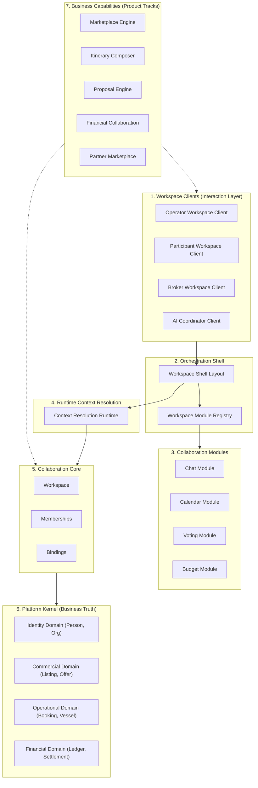

# Platform Capability Map

This diagram maps the layered architectural primitives of the Tuamotu Platform, showing how future business capabilities and client experiences compose the unified platform foundations.

