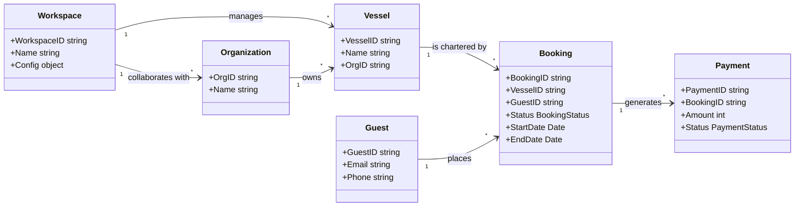

# Architecture Overview

This document describes the structural design, component directory layouts, and integration boundaries of the **MY Whiskey** platform.

---

## 1. Current State

The platform is built using a serverless architecture based on **Next.js 16 (App Router)** and **React 19**, running serverless functions via Firebase. 

### System Layout Map
*   `/src/app/`: Next.js App Router pages, layout, and components.
*   `/src/app/api/`: Backend serverless API routes.
*   `/src/app/admin/`: Admin panels for bookings, vessel management, and campaigns.
*   `/src/components/`: Reusable, custom React components.
*   `/src/lib/`: Backend database modules (`db.ts`, `adminDb.ts`), Stripe configurations, and SaaS providers (Telnyx, Resend).
*   `/src/store/`: Client-side state management implemented via Zustand.

### Server/Client SDK Boundaries
To prevent server credentials leaking into client bundles, the code enforces a strict import separation:
*   **Server-Side Admin Database**: All server operations and API handlers must use the Server SDK (`firebase-admin`) initialized through `@/lib/adminDb.ts`. Private keys are loaded from Firebase Secret Manager or secure environment variables.
*   **Client-Side Database**: The client interface accesses read-only content directly through client SDK configurations or Next.js route API wrappers. Client code must never import from `firebase-admin` or `@/lib/adminDb`.
*   **Secret Key Isolation**: No private keys (Stripe secret keys, Telnyx keys, Resend credentials, Meta Page tokens) can be imported or used in files marked with `'use client'`.

---

## 2. Approved Direction

The approved design focuses on a decoupled, enduring **Logical Persistence Model** that exists independently of the underlying database technology.

### Logical Persistence Model
Rather than coupling the system to Firestore collection patterns, the core domain model defines four major logical entities, their relationships, and lifecycle states, wrapped by Workspace operating contexts:

#### Naming & Consistency Conventions
*   **Booking Lifecycle States**: `draft` $\rightarrow$ `proposed` $\rightarrow$ `confirmed` $\rightarrow$ `completed` / `cancelled`.
*   **Payment States**: `pending` $\rightarrow$ `succeeded` / `failed` / `refunded`.
*   **Guest**: Always represent customer entities as `Guest` (never `Customer` or `User`) to align with luxury yachting ontology.

### Code Intelligence via Graphify
The repository maintains a descriptive AST analysis process using **Graphify**. 
*   **Functionality**: Graphify generates `graph.json` representing current codebase dependencies and structural references.
*   **Role**: Serves as a prescriptive verification step within the CI/CD pipeline, ensuring changes match the architectural boundaries specified here.

---

## 3. Potential Future

*   **GraphQL/Federated API Layer**: A unified API gate separating the frontend rendering completely from backend Microservices.
*   **Multi-Region Event Sourcing**: Outbox patterns to sync Booking events to multi-region relational replicas.
*   *Warning: Developer agents must NOT execute or implement any item under this section until it is migrated to an Approved Direction.*
