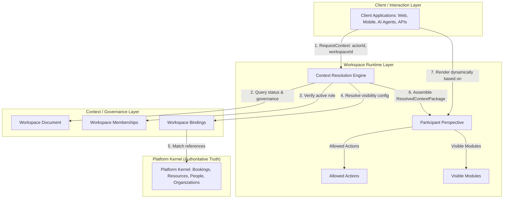

# Workspace Runtime Architecture

This document defines the runtime interaction model of the Tuamotu Workspace Collaboration layer, focusing on how participant-specific operating contexts are resolved.

---

## 1. Runtime Architecture Flow

The workspace collaboration architecture decouples authoritative truth (Platform Kernel) from interaction contexts (Participant Perspectives). The **Context Resolution Engine** acts as the single gateway that maps raw platform concepts into secure, channel-specific packages:

---

## 2. Component Roles

1.  **Platform Kernel (Truth)**: Authoritative business models. It has no awareness of workspaces, collaboration states, or participant permissions.
2.  **Context / Governance Layer**: Defines the collaboration boundaries. It stores administrative metadata, member roles (`/workspace_memberships`), and references linking workspaces to kernel concepts (`/workspace_bindings`).
3.  **Context Resolution Engine**: A side-effect free compiler that merges governance policies and member permissions to produce a dynamic perspective.
4.  **Participant Perspective**: A context contract mapping exactly what modules are visible and what operations are permitted for the participant.
5.  **Client Applications**: Consumers of the Resolved Context Package. They do not calculate security boundaries; they only present the interface matching the allowed actions.
